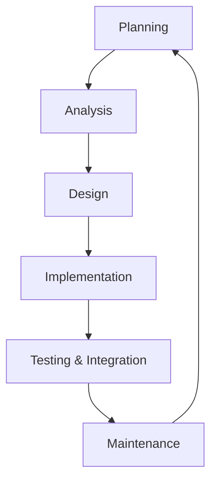

SDLC is a structured process used by software developers to design, develop, and test high-quality software. It aims to produce a high-quality product that meets or exceeds customer expectations within the time and cost estimates.

### SDLC Phases

### Phase Details

1.  **Planning**: Define the scope, objectives, and feasibility of the project. Identify resources and potential risks.
2.  **Analysis**: Gather requirements from stakeholders and define the "What" of the software system.
3.  **Design**: Define the "How" of the system. Design software architecture, UI/UX, and database schemas.
4.  **Implementation**: This is the actual coding phase. Developers write code according to the design specifications.
5.  **Testing & Integration**: Verify that the software is bug-free and meets the requirements. Integrate different modules.
6.  **Maintenance**: Deploy the software and perform ongoing updates, bug fixes, and improvements.

### Common Methodologies

-   **Waterfall**: Linear and sequential; each phase must be completed before the next begins.
-   **Agile**: Iterative and incremental; focuses on flexibility, collaboration, and customer feedback.
-   **Scrum**: A specific Agile framework using Sprints, Daily Stand-ups, and Retrospectives.
-   **Kanban**: A visual system for managing work as it moves through a process.
-   **DevOps**: A set of practices that combines software development (Dev) and IT operations (Ops).
-   **Spiral**: Combines iterative development with systematic aspects of the Waterfall model, focusing on risk assessment.
