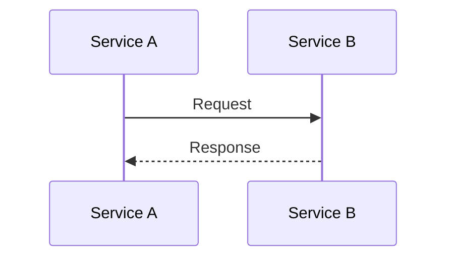
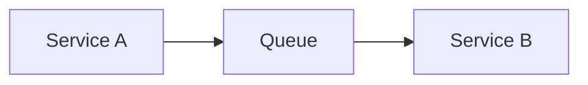
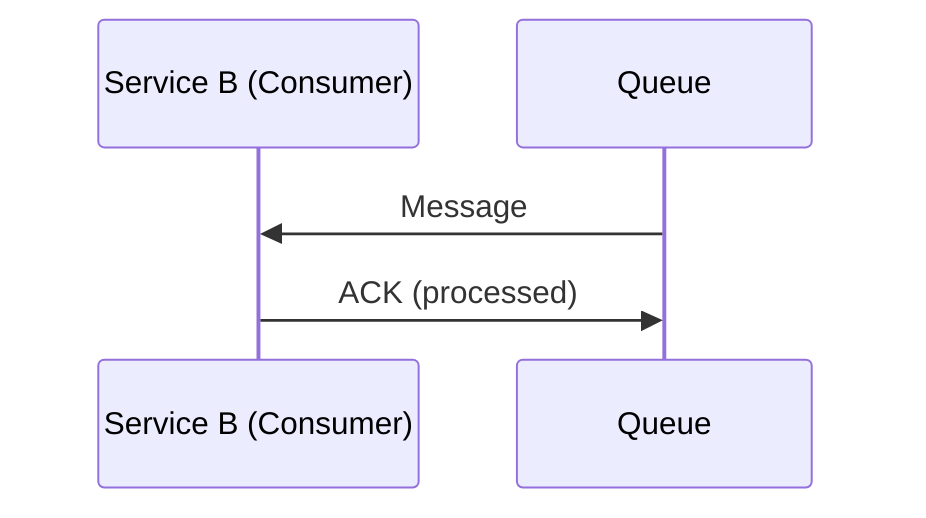
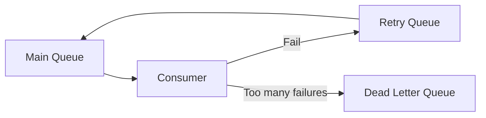
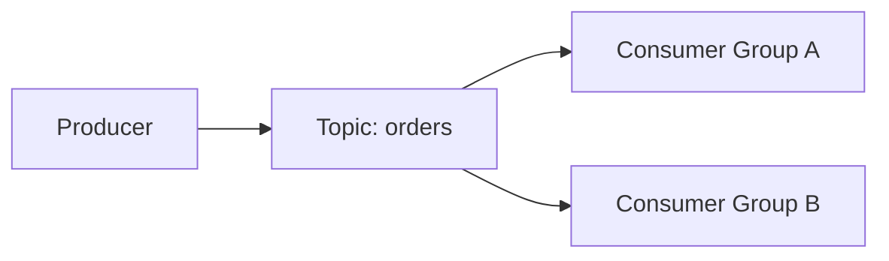

How services communicate with each other (Sync vs. Async).

- **Sync** → Request/Response (wait for answer)
- **Async** → Send a message/event (process later)

# 1) Synchronous Communication

Service A calls Service B and waits for a response.

## Common Technologies

* REST (HTTP + JSON)
* gRPC (HTTP/2 + Protobuf)
* SOAP (XML)

## When to Use

* Immediate response required
* User-facing actions
* Simple request/response

## Main Risks

* Tight coupling
* Cascading failures
* Timeouts impact user experience

## Basic Rules

* Always use timeouts
* Avoid long service call chains
* Add retries carefully (only for safe operations)

# 2) Asynchronous Communication

Service A sends a message and continues.
Processing happens later.

# 2.1 Messaging (RabbitMQ / ActiveMQ / ...)

Message goes to a queue. Consumer processes it.

## Queue

## With ACK

## Why Use Messaging

* Decouples services
* Handles traffic spikes
* Built-in retry capability

## Core Rules

* Messages must have unique ID
* Consumers must be idempotent
* Use retry limits
* Use Dead Letter Queue (DLQ)

## Retry + DLQ Concept

# 2.2 Streaming (Kafka)

Events are written to a topic.
Multiple consumers can read the same events.

## Diagram (Kafka Topics)

## Key Ideas

* Events stored for retention period
* Consumers track offset
* Ordering guaranteed per partition

## When to Use

* Event-driven systems
* Multiple services need same data
* High throughput

# 3) Sync vs. Async (Quick Decision Guide)

## Use Sync

* Need immediate result
* Simple request/response
* User is waiting

## Use Async

* Can process later
* Need resilience
* Expect traffic spikes
* Want loose coupling

# Key Takeaway

**Sync** → Simple but tightly coupled
**Async** → More scalable, resilient, and flexible
