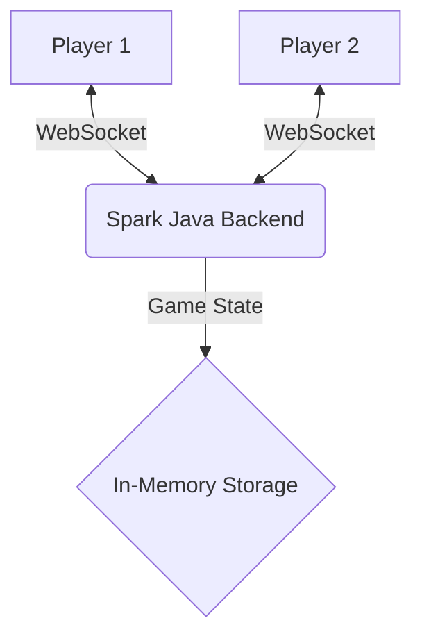

* **Backend**: **Spark Java** micro-backend + **WebSockets** (first experience)
* **Frontend**: **Vanilla JS** + **Tailwind CSS**
* **Real-time**: **WebSocket**-based state synchronization for multiplayer sessions
* **Code quality**: **SonarCloud** integration for static analysis and quality gates
* **Test coverage**: **JaCoCo** reports published into **SonarCloud**
* **Containerization**: **Docker** image builds using **Jib** (no Dockerfile needed)
* **Code style**: **Spotify fmt/check** plugin for consistent formatting and validation
* **No database**: Rooms and game sessions stored in **memory**
* **Zero auth**: Players join instantly by entering a name

> **Bonus:** Beyond the technical challenge, I discovered that this is a great game to play with friends! We still enjoy playing it together from time to time.