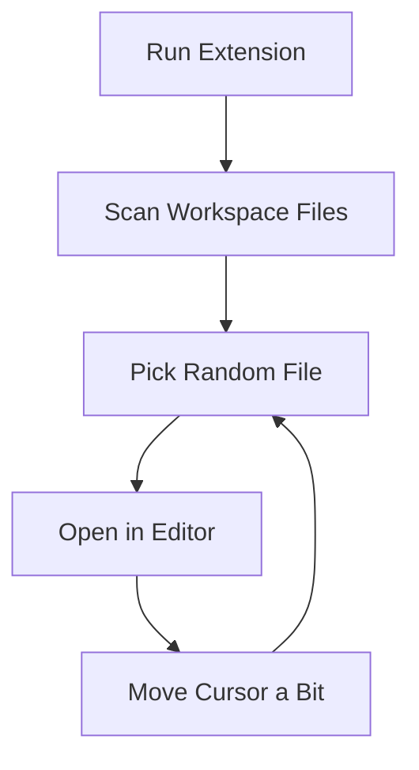

* Built a VS Code extension in **JavaScript** that randomly opens workspace files and moves the cursor around like it’s "busy"
* Implemented workspace file discovery + random rotation logic across the project directory
* Integrated simple editor actions (open file, set selection, cursor movement) using VS Code Extension API
* Set up GitHub Actions to build and package the extension into `.vsix` artifacts
* Automated GitHub Releases with **multi-platform builds (Windows/macOS)** so the extension can be downloaded directly from CI

**Purpose:** A small “because I can” project - play with VS Code extension APIs and automate code browsing.

**Bonus:** Practiced CI/CD + release automation by generating ready-to-install `.vsix` builds for Windows/macOS via GitHub Actions and publishing them through GitHub Releases.

> **Disclaimer:** This bot moves the cursor. It does not fix bugs, write features, or survive standups on your behalf.