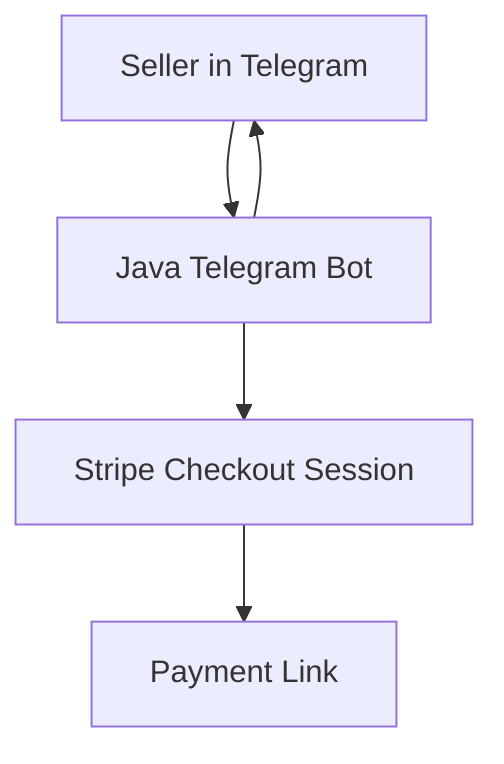

* Implemented chat-based product + pricing flow and automated generation of Stripe Checkout payment links
* Integrated Stripe Checkout via Stripe Java SDK to create single-payment sessions securely
* Built framework-free Java service with minimal dependencies for fast startup and low memory usage
* Containerized the application and delivered ARM32-compatible Docker images for Raspberry Pi deployments
* Configured runtime via environment variables with optional properties-based fallback for flexible deployments
* Added structured logging using SLF4J + Logback for easier troubleshooting and observability

**Purpose:** Enable quick payment link creation directly from Telegram without building a full storefront UI.

**Bonus:** Used this project to experiment with multi-architecture Docker image builds (ARM32 for Raspberry Pi) and validate how far a small, framework-free Java service can go in terms of memory efficiency and operational simplicity.