Continuous Integration and Continuous Delivery (CI/CD) automate the process of building, testing, and deploying
software. Modern cloud-native systems rely on safe deployment strategies and declarative infrastructure workflows to
reduce risk and improve reliability.

# CI/CD Overview

## Continuous Integration (CI)

Developers frequently merge code into a shared repository. Each merge triggers:

- Automated build
- Automated tests
- Static analysis
- Security scans

### CI Flow

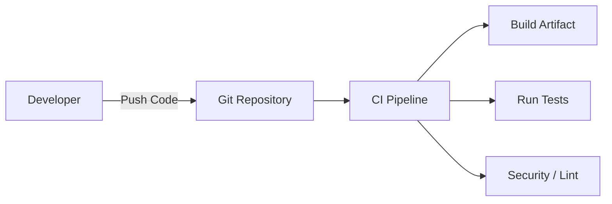

## Continuous Delivery / Deployment (CD)

After CI succeeds, the system:

- Packages artifacts (Docker image, binary, etc.)
- Deploys to staging
- Optionally deploys automatically to production

### CD Flow

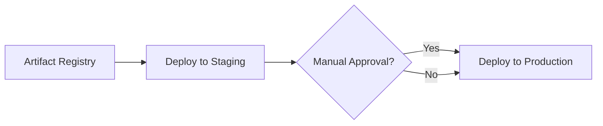

# Deployment Strategies

Deployment strategies reduce risk when releasing new versions.

# Blue-Green Deployment

Two identical environments:

- **Blue** → current production
- **Green** → new version

Traffic switches only after validation.

## Flow

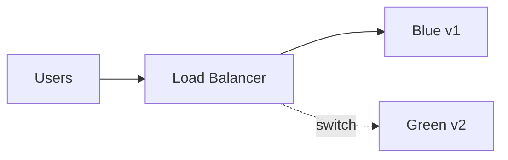

## Process

1. Deploy a new version to Green
2. Test Green
3. Switch traffic from Blue → Green
4. Keep Blue as a rollback target

## Pros

- Instant rollback
- Minimal downtime
- Simple mental model

## Cons

- Doubles infrastructure cost
- Database migrations must be backward compatible

# Canary Deployment

Release to a small percentage of users first.

## Flow

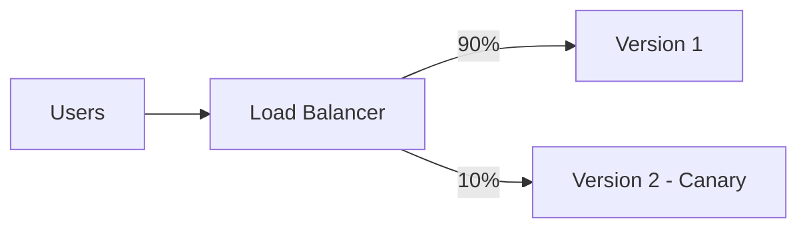

Gradually increase traffic if metrics are healthy.

## Steps

1. Deploy v2
2. Route 5–10% traffic
3. Monitor:
   - Error rate
   - Latency
   - Business metrics

4. Gradually increase traffic

## Pros

- Low risk
- Real production testing
- Metric-driven rollout

## Cons

- More complex routing
- Requires observability

# Rolling Deployment

Incrementally replace pods/instances.

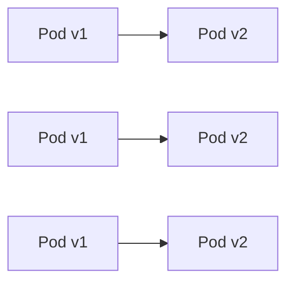

Common in Kubernetes using:

```yaml
strategy:
  type: RollingUpdate
  rollingUpdate:
    maxUnavailable: 1
    maxSurge: 1
```

# Push vs. Pull-Based Pipelines

# Push-Based Deployment

The CI server pushes changes to the cluster.

## Flow

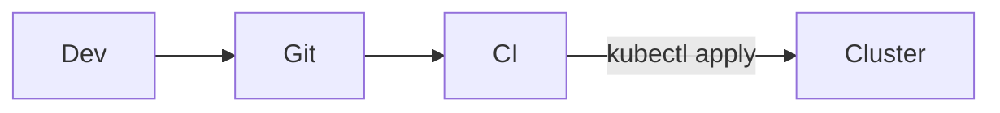

### Characteristics

- CI system needs cluster credentials
- Centralized control
- Traditional model

### Risks

- Credential leakage
- Harder to scale across clusters

# Pull-Based Deployment

The cluster pulls desired state from Git.

Used in **GitOps**.

## Flow

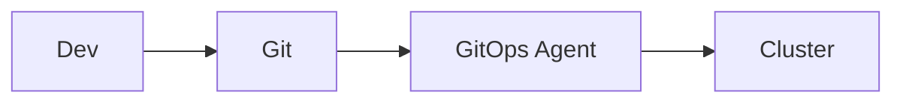

Examples:

- ArgoCD
- Flux

### Characteristics

- Cluster has read-only access to Git
- Declarative desired state
- Self-healing

# Push vs Pull Comparison

| Aspect                   | Push           | Pull                  |
| :----------------------- | :------------- | :-------------------- |
| Who initiates deployment | CI server      | Cluster agent         |
| Credentials location     | CI             | Cluster               |
| Drift detection          | Manual         | Automatic             |
| Security model           | Broader access | Reduced CI privileges |
| Multi-cluster scaling    | Harder         | Easier                |

# GitOps

GitOps is an operational model where:

- Git is the single source of truth
- Desired state is declarative (YAML, Helm, Kustomize)
- Cluster continuously reconciles with Git

## GitOps Architecture

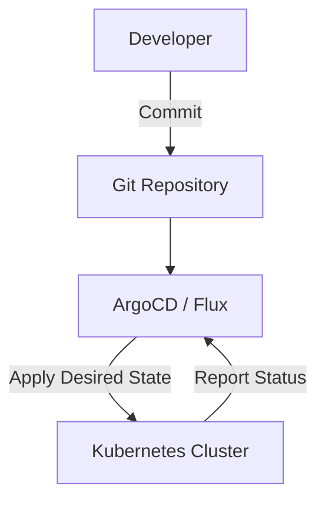

## GitOps Principles

1. Declarative infrastructure
2. Version-controlled desired state
3. Automated reconciliation
4. Observable system state

## Reconciliation Loop

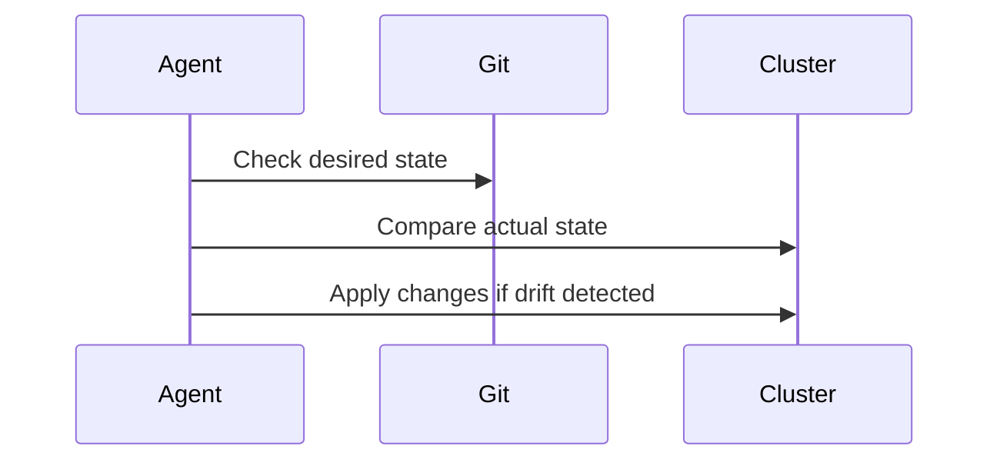

# Safe Deployment Patterns in Kubernetes

## Progressive Delivery

Combines:

- Canary
- Feature flags
- Automated rollback

Often implemented with:

- Argo Rollouts
- Flagger
- Service Mesh (Istio, Linkerd)

## Feature Flags

Separate deployment from release.

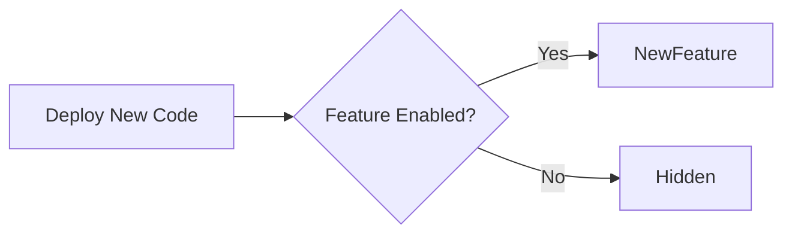

Benefits:

- Instant enable/disable
- A/B testing
- Gradual feature exposure

# CI/CD Best Practices

- Trunk-based development
- Small frequent releases
- Immutable artifacts
- Automated testing
- Observability-first deployments
- Backward-compatible DB migrations
- Infrastructure as Code (IaC)

# End-to-End Example

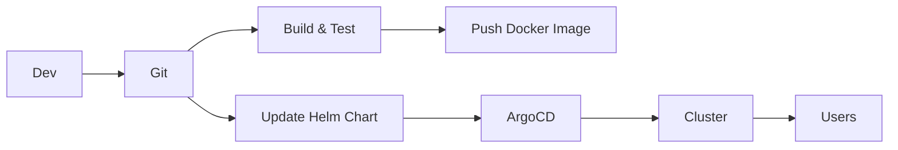
