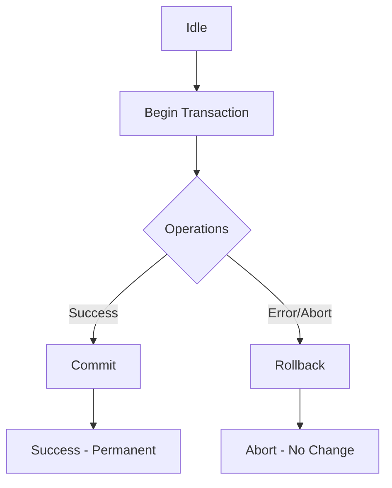

### Database Transactions

A database transaction is a logical unit of processing that consists of one or more database operations (like INSERT, UPDATE, DELETE). Transactions ensure that either all operations are completed successfully, or none are applied, maintaining data integrity.

### Transaction Lifecycle

### ACID Properties

- **Atomicity**: "All or nothing." If any part of the transaction fails, the entire transaction is rolled back.
- **Consistency**: Ensures the database moves from one valid state to another, maintaining all predefined rules (constraints, triggers).
- **Isolation**: Transactions are independent; the intermediate state of a transaction is invisible to others. Different **Isolation Levels** control how visible changes are to other concurrent transactions:
  - **Read Uncommitted**: Lowest level; a transaction may read uncommitted changes from others (**Dirty Read**).
  - **Read Committed**: Only reads committed data. Prevents Dirty Reads but not **Non-repeatable Reads** (data can change between reads in the same transaction).
  - **Repeatable Read**: Ensures that if a row is read twice, it has the same values. Prevents Dirty and Non-repeatable reads, but may allow **Phantom Reads** (new rows appearing).
  - **Serializable**: Highest level; transactions are executed as if they were sequential, preventing all the above phenomena.
- **Durability**: Once a transaction is committed, it remains committed even in the event of a system failure.

### Managing Transactions

- **Open (BEGIN)**: Starts the transaction, marking the beginning of the atomic unit.
- **Commit**: Saves all changes made during the transaction permanently to the database. It is needed because, until committed, changes are only temporary and can be undone.
- **Rollback**: Reverses all changes made since the transaction began.
- **Savepoint**: A point within a transaction to which you can roll back without undoing the entire transaction. Useful for complex, multi-step operations.

### Connection Pooling

Instead of opening and closing a new database connection for every request (which is expensive and slow), a **Connection Pool** maintains a cache of open connections that can be reused.

- **Efficiency**: Reduces the overhead of establishing new connections.
- **Performance**: Faster response times as connections are readily available.
- **Resource Management**: Prevents the database from being overwhelmed by too many simultaneous connection attempts.
