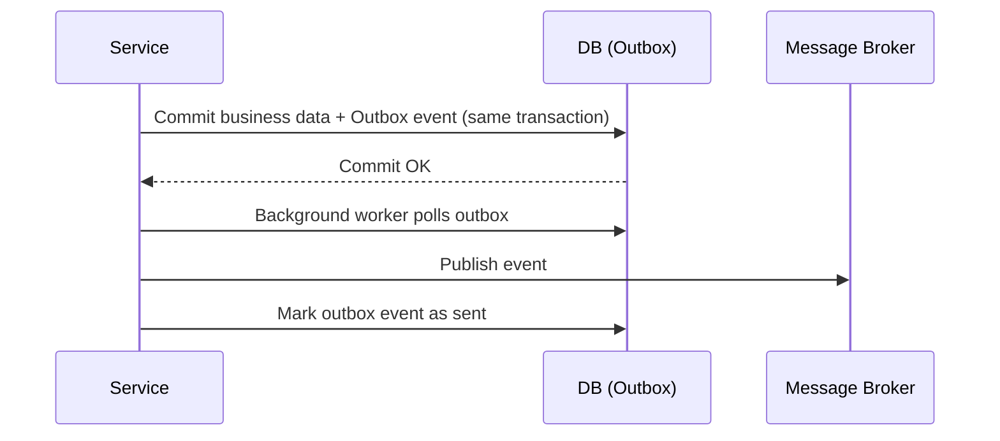

### API Gateway Pattern

An API Gateway is a single entry point for clients that routes requests to the right microservice and can handle
cross-cutting concerns.

- **Why**: Simplifies clients, reduces chatty client↔service calls, centralizes concerns.
- **Typical responsibilities**:
  - Routing + request aggregation (compose data from multiple services)
  - AuthN/AuthZ, rate limiting, request validation
  - TLS termination, caching, response shaping

- **Good practices**:
  - Keep it **thin** (avoid business logic creeping into the gateway)
  - Prefer **BFF (Backend for Frontend)** gateways when multiple client types exist (web, mobile)

### Strangler Fig Pattern

A migration approach where you incrementally replace parts of a monolith by building new microservices around it until
the monolith “shrinks away.”

- **How it works**:
  - Route some functionality to new services while the rest still goes to the monolith.
  - Gradually move more endpoints/features over time.

- **Good practices**:
  - Start with **low-risk, high-value** slices (read-only features, reporting, simple workflows)
  - Put routing rules in the gateway / edge layer so migration is transparent to clients

### Database per Service

Each microservice owns its data and does not directly access another service’s database.

- **Why**: Prevents tight coupling, enables independent deployment and scaling.
- **Trade-off**: Cross-service queries become harder; you typically use events + read models.
- **Good practices**:
  - Enforce ownership strictly (no “shared DB”)
  - Use **async replication** (events) to create **materialized views** for query needs

### CQRS (Command Query Responsibility Segregation)

Separate the models for **writes (commands)** and **reads (queries)**.

- **Why**: Reads and writes often have different performance/scaling needs.
- **Pairs well with**: Event Sourcing (events drive read projections), but CQRS can be used without it.
- **Good practices**:
  - Keep commands **task-focused** (e.g., `PlaceOrder`, not `UpdateOrder`)
  - Expect **eventual consistency** on read models and design UI/UX accordingly

### Outbox Pattern

Ensures reliable event publishing when you update a database and need to emit an event.

- **Problem**: “DB commit succeeded but message publish failed” (or vice versa).
- **Solution**: Write outgoing events into an **outbox table** in the same DB transaction, then a background worker
  publishes them.

- **Good practices**:
  - Make publishing **idempotent** (safe to publish the same event again)
  - Use **deduplication keys** / event IDs and consumer-side dedupe

### Idempotency Pattern

Design operations so repeating the same request produces the same result (or at least no harmful side effects).

- **Where it matters**: retries, timeouts, “at least once” messaging.
- **Techniques**:
  - **Idempotency key** (client-provided or generated)
  - **Upserts** instead of inserts where appropriate
  - Consumer dedupe using **event IDs**

- **Good practices**:
  - Store idempotency records with a sensible TTL
  - Make side effects (emails, payments) explicitly idempotent

### Service Discovery Pattern

Services find each other dynamically rather than via hard-coded addresses.

- **Client-side discovery**: client (or SDK) queries registry and load balances.
- **Server-side discovery**: client calls a load balancer which resolves services.
- **Good practices**:
  - Prefer stable naming (e.g., `inventory-service`) and let infra resolve endpoints
  - Combine with **health checks** and **timeouts** (discovery alone doesn’t fix failures)

## Microservice Good Practices (cross-cutting)

### Observability (Logs, Metrics, Traces)

- **Distributed tracing**: propagate `trace_id` / `correlation_id` across calls.
- **Structured logs**: JSON logs with service name, request ID, user ID (if applicable).
- **Golden signals**: latency, traffic, errors, saturation.

### Contract Management

- Use **consumer-driven contracts** to prevent breaking changes.
- Prefer **backward-compatible** API evolution:
  - Add fields, don’t remove/rename
  - Version carefully (avoid “v2 everywhere” unless necessary)

### Timeouts, Bulkheads, and Backpressure

- Always set **timeouts** (client + server).
- Use **bulkheads** (separate thread pools/connection pools per dependency).
- Apply **rate limiting** and **queue limits** to avoid cascading failures.

### Message/Event Hygiene

- Use **immutable events** (don’t “edit history”)
- Include metadata: `event_id`, `occurred_at`, `schema_version`, `producer`
- Design consumers to be **idempotent** and tolerate out-of-order delivery
