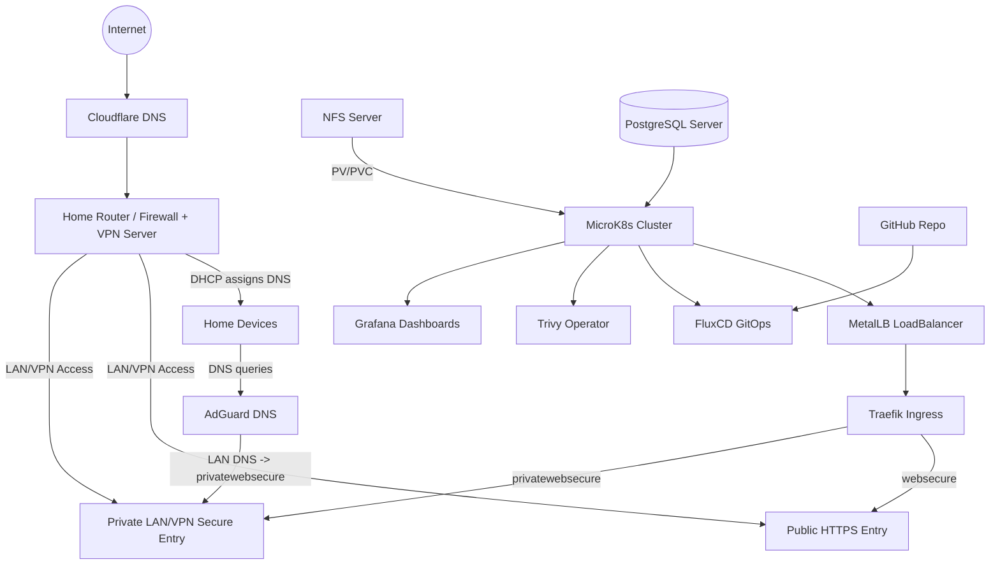

This project is a GitOps-managed homelab Kubernetes cluster running inside a private network behind a home router. The cluster is built on MicroK8s and fully deployed through FluxCD, where Git acts as the single source of truth for infrastructure and services. Traffic routing is handled by Traefik with two entrypoints: websecure (public HTTPS with automatic TLS certificates via Cloudflare + ACME) and internal (LAN/VPN-only access for private services). Persistent data is stored on an external NFS server and claimed in the cluster through Kubernetes volumes. The cluster includes Trivy Operator for security checks and Grafana dashboards for hardware metrics and vulnerability reports. Internal-only services include a custom NGINX landing page, router configuration proxies, AdGuard DNS, pgAdmin, and additional utilities. The homelab also includes separate private servers providing PostgreSQL, private DNS records, VPN access, and NFS storage. Future improvements include SSO and RAID-backed storage.

### Key Features & Details

- **Platform**: **MicroK8s** Kubernetes cluster running inside a private LAN
- **GitOps**: **FluxCD** continuously syncs cluster state from GitHub
- **Ingress & Routing**: **Traefik Ingress** exposes 2 main entrypoints:
  - `websecure` → **Public HTTPS Entry** (Cloudflare-facing)
  - `privatewebsecure` → **Private LAN/VPN Secure Entry** (internal-only)
- **TLS Automation**: **Cloudflare DNS + ACME (Let's Encrypt)** for automatic certificate issuance/renewal
- **Load Balancing**: **MetalLB LoadBalancer** provides stable LAN IPs and fronts all Traefik entrypoints
- **Storage**: **NFS server** provides persistent volumes (**PVCs**) for stateful workloads
- **Security**: **Trivy Operator** performs vulnerability + misconfiguration scanning across workloads
- **Monitoring**: **Grafana** dashboards for cluster/hardware metrics and Trivy reports
- **DNS Control**: **AdGuard DNS** distributes ad-blocking + internal DNS across all home devices via router DHCP
- **Internal Services**: **NGINX landing page**, **pgAdmin**, router proxies, and other personal tools
- **Custom Apps**: Self-hosted deployments for games (**Bunker**, **Spy**, **Battleship**) + personal **Resume**
- **External Private Servers**: Dedicated **PostgreSQL**, private DNS records, **NFS storage**, and other LAN services
- **Roadmap**: **SSO**, **RAID**, cluster hardening and access policy improvements

**Purpose:** Build a real home lab from scratch to learn Kubernetes, GitOps workflows, reverse proxy routing, and secure LAN-first service exposure.

**Bonus:** With AdGuard distributed via DHCP, every device automatically gets centralized DNS filtering and internal routing without manual configuration per device.

> **Note:** Most internal services are reachable only through `privatewebsecure` (LAN/VPN). Public-facing apps use `websecure` with Cloudflare-managed DNS + automated TLS.
