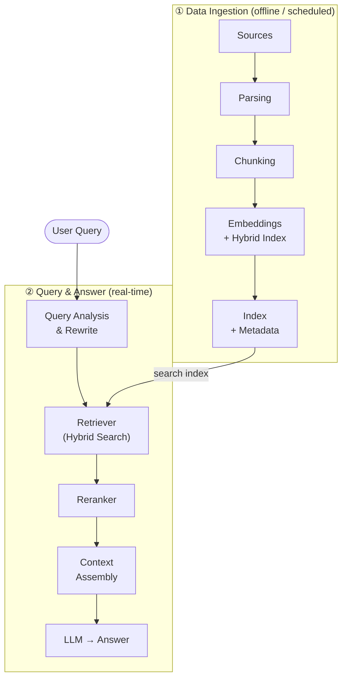
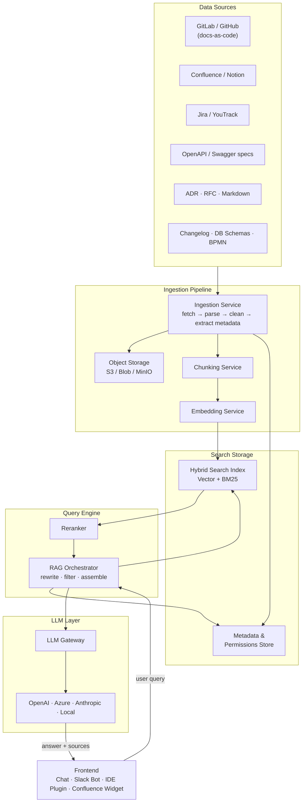
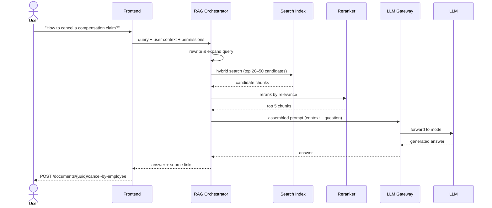

**RAG (Retrieval-Augmented Generation)** is an approach where a language model, before answering, first retrieves relevant materials from an external source — documentation, knowledge bases, CRM, Confluence, GitHub, Notion, PDFs, databases, etc.

A regular LLM answers from what it learned during training. RAG additionally grounds the answer in **your actual data**.

# The Two-Loop Architecture

RAG splits work into two independent loops — ingestion (building the index) and retrieval (answering queries).



# Full System Architecture



# Loop 1 — Data Ingestion

## Step 1: Data Sources

Everything that holds knowledge about your system. RAG does not replace sources — it searches them.

- GitLab / GitHub with docs-as-code
- Confluence, Notion
- Jira / YouTrack (tickets, requirements)
- OpenAPI / Swagger specs
- Markdown documentation, ADR / RFC
- READMEs from service repositories
- PlantUML / BPMN / sequence diagrams
- Changelog / release notes
- Database schemas

> **Important:** sources remain the single source of truth. RAG must not become a new knowledge base where everything is copied and forgotten to update.

## Step 2: Ingestion Service

A separate service or scheduled job that regularly fetches documents from sources.

- Fetches new and changed documents
- Parses Markdown, HTML, PDF, OpenAPI, tables
- Removes noise: menus, footers, duplicate blocks
- Extracts metadata from each document
- Sends cleaned text to the chunking step

**Trigger strategies:**
- GitHub/GitLab: web hook on merge to `main`
- Confluence: schedule or API polling
- OpenAPI specs: after repository update or release

## Step 3: Object Storage

Raw copies of source documents are stored separately (S3 / Blob / MinIO), allowing re-indexing when chunking strategy or embedding model changes.

Each stored artifact may include:
- Source document (raw)
- Cleaned text
- JSON with metadata
- Document version
- Link to original
- Indexing timestamp

## Step 4: Chunking Service

Splits documents into small semantic pieces. For developer documentation, cut by **structure** — not by character count:

| Chunk type | Example |
|---|---|
| Service description | Overview section |
| Endpoint | `POST /orders` |
| Status table | Order statuses |
| Error list | API errors |
| Diagram | Checkout sequence flow |
| Business rule | Cancellation conditions |

> **Tip:** 1000-character windows lose context. Structure-aware chunking produces far better retrieval.

## Step 5: Embedding Service

Converts each chunk into a numerical vector (embedding). Enables **semantic search** — finding relevant chunks even when exact words differ.

Example: the query _"How to create an order request?"_ can surface `POST /orders` even if the word "request" never appears in the spec.

## Step 6: Search / Vector Storage

Stores the hybrid search index. Real-world systems combine two retrieval strategies:

| Strategy | Strength |
|---|---|
| Vector search (ANN) | Captures meaning, handles paraphrases |
| Keyword / BM25 | Captures exact names, IDs, error codes |

Each indexed record holds:

```json
{
  "text": "...",
  "embedding": [...],
  "metadata": { ... },
  "source_url": "...",
  "access_rules": [...],
  "document_version": "25.5"
}
```

**Popular storage options:**
- Elasticsearch / OpenSearch
- Azure AI Search
- PostgreSQL + pgvector
- Qdrant, Milvus, Pinecone
- Vertex AI Vector Search
- Amazon OpenSearch / Bedrock Knowledge Bases

## Step 7: Metadata & Permissions Store

Every chunk must carry rich metadata to filter results correctly and respect access control.

```json
{
  "system": "Trading Platform",
  "service": "orders-service",
  "doc_type": "api_spec",
  "source": "gitlab",
  "branch": "main",
  "version": "25.5",
  "language": "en",
  "owner_team": "Platform",
  "source_url": "...",
  "access_groups": ["dev", "analysts", "qa"]
}
```

Without metadata the system will confuse different systems, versions, products, roles, and document statuses.

# Loop 2 — Query & Answer



## Step 1: Query Analysis & Rewrite

Before searching, the orchestrator improves the raw query:

- Understands dialog context (follow-up questions)
- Removes noise, clarifies entities
- Expands abbreviations
- Rewrites into search-friendly form

## Step 2: Retriever (Hybrid Search)

Searches the index and returns 20–50 candidate chunks. Uses both vector similarity and keyword matching simultaneously for best recall.

## Step 3: Reranker

Re-reads the question alongside each retrieved chunk and **re-scores them by actual usefulness** — not by vector similarity. Selects the top 5–10 chunks for the prompt.

> First-pass retrieval casts a wide net. Reranking is what keeps the prompt focused.

## Step 4: RAG Orchestrator

The central service that coordinates the whole flow:

1. Receive user question
2. Identify user and their access rights
3. Rewrite query for search
4. Search candidates in hybrid index
5. Apply metadata filters
6. Run reranking
7. Assemble prompt for LLM
8. Send request to LLM Gateway
9. Return answer + source links

## Step 5: LLM Gateway

LLMs are never called directly from the frontend. The gateway sits between and handles:

- Hiding API keys
- Logging all requests
- Rate limiting and cost control
- Model selection / routing
- Masking sensitive data
- Fallback to another model
- Storing prompt templates

# Frontend Options

| Interface | Best for |
|---|---|
| Chat in corporate portal | General QA, onboarding |
| Slack / Teams bot | Quick lookups in existing workflow |
| IDE Plugin | Developers querying specs inline |
| Confluence Widget | Contextual help next to docs |
| Standalone internal assistant | Dedicated AI assistant product |

# Example: Developer Documentation Assistant

**Goal:** An assistant for developers, analysts, and QA that answers questions about requirements, APIs, ADRs, schemas, and tasks.

**Scenario:** A tester asks:
> _"How to cancel a compensation claim by an employee?"_

RAG must find not just similar words but the specific relevant specification:

```
POST /documents/{uuid}/cancel-by-employee
```

Without RAG, the LLM would either hallucinate an answer or say it doesn't know. With RAG, it grounds the answer in the actual OpenAPI spec from GitLab.

# Common Pitfalls

| Problem | Consequence |
|---|---|
| Bad source documents | Bad answers |
| Bad parsing | Relevant chunks never found |
| Bad chunking | Answer torn out of context |
| Bad retrieval | Answer based on irrelevant data |
| No reranking | Too much noise in the prompt context |
| No metadata | System confuses products, versions, and roles |
| No prompt injection protection | External document controls model behavior |
| Weak system prompt | Model answers from its head when no data is available |

# Quick Checklist

Before going to production:

- [ ] Sources are the primary truth — not the RAG index
- [ ] Ingestion is triggered automatically (webhook / schedule)
- [ ] Chunks split by structure, not character count
- [ ] Hybrid index: vector + BM25
- [ ] Every chunk has rich metadata including access groups
- [ ] Reranker is in the pipeline
- [ ] LLM Gateway handles keys, logging, and rate limits
- [ ] System prompt explicitly instructs: answer only from context
- [ ] Prompt injection risk is mitigated
- [ ] Object storage allows full re-indexing