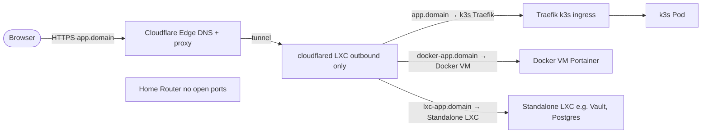
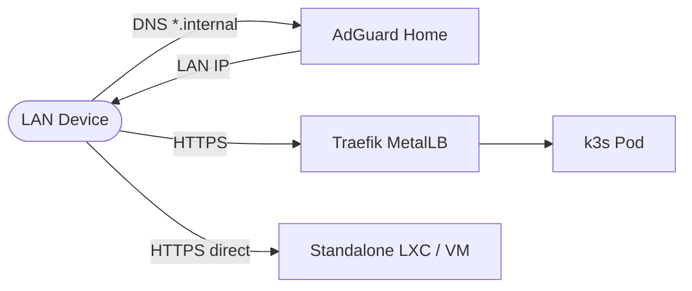
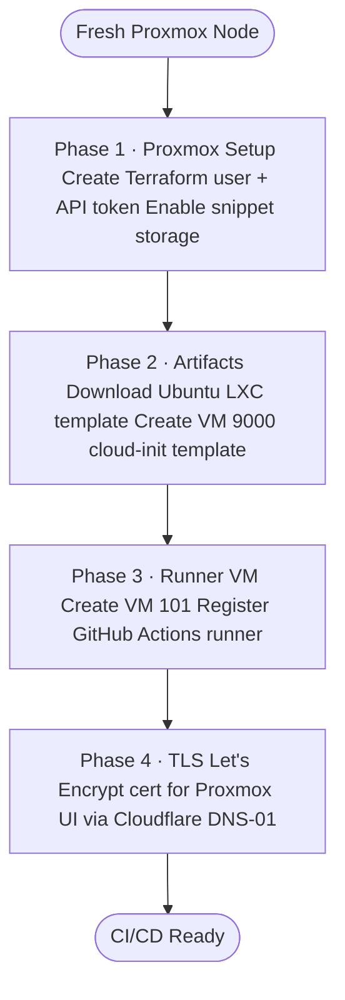
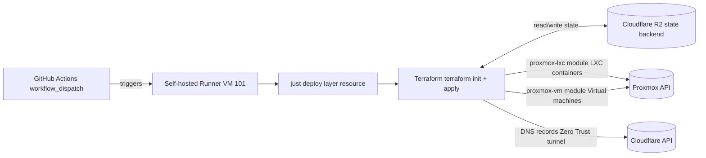
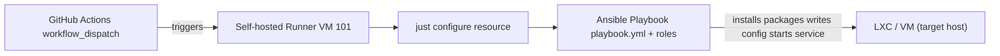
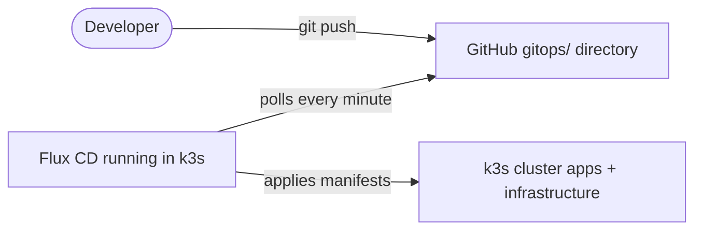
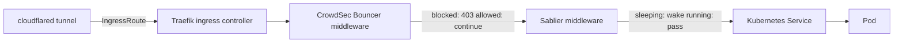
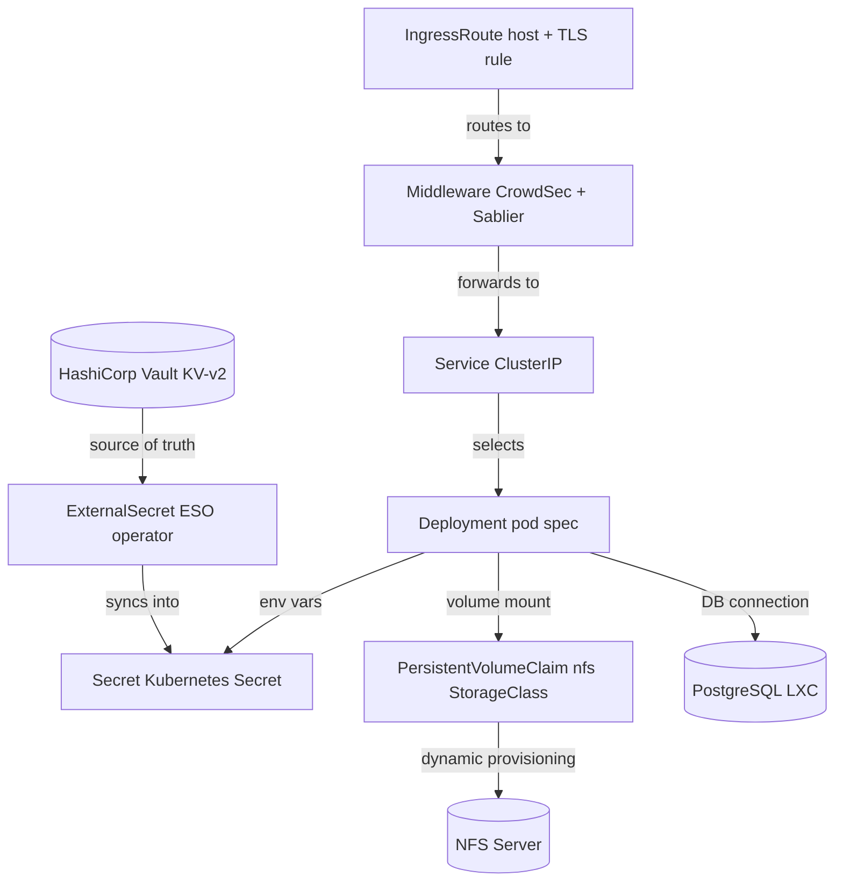

A self-hosted environment running on bare metal at home - fully automated from the moment Proxmox is installed to apps
being live on the internet. No manual steps, no clicking through UIs.

**Proxmox VE** runs on the physical machine and hosts everything as VMs or lightweight containers (LXC).

**Terraform** writes the infrastructure as code - it creates the containers, sets up DNS records in Cloudflare, and
stores its state remotely in **Cloudflare R2** so nothing is tied to a single machine.

**Ansible** configures each machine after it's created - installs packages, sets up services, and keeps everything
consistent.

A two-node **k3s** Kubernetes cluster runs the actual workloads, kept in sync automatically by **FluxCD** - any change
pushed to GitHub gets applied to the cluster within minutes.

Public traffic reaches the cluster without any open ports: a **Cloudflare Zero Trust Tunnel** runs on a dedicated LXC
container and forwards requests directly to **Traefik** inside the cluster. No firewall rules, no exposed IP.

**Public traffic** - the router has zero open ports. The `cloudflared` daemon on a dedicated LXC opens a single
outbound connection to Cloudflare. When a browser hits any public hostname, Cloudflare routes the request through that
tunnel to `cloudflared`, which then forwards it to the right backend based on per-hostname ingress rules. Each rule maps
a hostname to a LAN IP - so traffic for a k3s app goes to Traefik, traffic for a Docker service goes directly to the
Docker VM, and traffic for a standalone LXC goes straight to that container. Adding a new public service is one line of
Terraform - no router config, no firewall rules, no port forwarding ever needed.

**Private traffic** - LAN-only services never leave the network. AdGuard Home resolves `*.internal` to local IPs:

### Automation Pipelines

**Step 1 - Bootstrap** (one-time, run locally against a fresh Proxmox node):

**Step 2 - Terraform** (provisions infrastructure, one resource at a time via GitHub Actions):

**Step 3 - Ansible** (configures each service after Terraform creates it):

**Step 4 - GitOps** (k3s workloads reconciled automatically by Flux CD):

### k3s Cluster

Every app runs inside a two-node k3s cluster managed by Flux CD. Traefik handles all ingress, backed by two middleware
layers that every public request passes through before reaching the app.

**Request flow** - from the tunnel to the pod:

**Traefik** is the ingress controller. It reads `IngressRoute` custom resources from the cluster and routes incoming
requests to the right service. TLS is terminated here using Let's Encrypt certificates issued automatically by
cert-manager via Cloudflare DNS-01 - no manual cert management. Two entrypoints keep public and private traffic
separate: `public-web-secure` for `*.pavel-usanli.online` (coming through the Cloudflare tunnel) and `websecure` for
`*.internal` (LAN-only).

**CrowdSec** runs as a Traefik bouncer plugin, sitting in front of every app. It maintains a local agent that parses
Traefik access logs in real time and matches them against a library of detection scenarios - brute force, path
traversal, scanner fingerprints, credential stuffing, and more. When a threat is detected the agent adds the IP to a
local blocklist. On top of that it subscribes to the CrowdSec community threat intelligence feed, which pushes known
bad IPs from thousands of other nodes worldwide. The bouncer intercepts every request before it reaches the app and
returns a `403` for any blocked IP - the app never sees the traffic at all.

**Sablier** solves the resource problem of running many low-traffic apps on a single machine. It integrates with
Traefik as a middleware and tracks which deployments are actively receiving requests. After a configurable period of
inactivity it scales the deployment down to zero replicas, freeing CPU and memory. When the first request arrives for
a sleeping app, Sablier holds the connection open, scales the deployment back up, waits for the pod to pass its
readiness probe, and only then forwards the request. From the user's perspective the app is simply slow to load the
first time - everything after that is instant. This makes it practical to host many apps on the same hardware without
them competing for resources when idle.

**App deployment layers** - every app is a stack of Kubernetes resources wired to external dependencies:

- **ExternalSecret + Vault** - no secrets live in Git. The External Secrets Operator pulls credentials from HashiCorp
  Vault (KV-v2) and writes them as standard Kubernetes Secrets. Apps consume them as env vars or mounted files.
- **NFS volumes** - a dedicated NFS VM provides the `nfs` StorageClass. PVCs are provisioned dynamically so pod
  restarts and node moves keep data intact.
- **PostgreSQL** - shared LXC used by apps that need a relational database. Connection string synced from Vault into
  the app's Secret automatically.

### Infrastructure Layers

- **Hypervisor**: **Proxmox VE** - all services live as VMs or LXC containers on a single bare-metal machine
- **IaC**: **Terraform** provisions every VM, container, and Cloudflare DNS record; state stored in **Cloudflare R2**
- **Config Management**: **Ansible** handles OS setup, package installs, and service config across all nodes
- **Kubernetes**: Two-node **k3s** cluster running on Proxmox VMs
- **GitOps**: **FluxCD** watches GitHub and continuously reconciles what's running with what's in the repo
- **Autoscaling**: **Sablier** scales idle apps to zero and wakes them on the first request - saves resources for
  services that aren't used constantly
- **CI/CD**: Self-hosted **GitHub Actions runner** on the LAN runs all Terraform and Ansible pipelines with direct
  Proxmox API access

### Networking & Traffic

- **Public ingress**: **Cloudflare Zero Trust Tunnel** - outbound-only connector, no open WAN ports
- **Ingress controller**: **Traefik** handles routing for both public (internet-facing) and private (LAN-only) services
- **Internal LB**: **MetalLB** gives Traefik a stable LAN IP inside k3s
- **DNS**: **AdGuard Home** handles ad-blocking and internal name resolution for all home devices
- **TLS**: **cert-manager** issues and renews Let's Encrypt certificates automatically via Cloudflare DNS challenge

### Security & Secrets

- **Intrusion Detection**: **CrowdSec** monitors traffic and blocks threats in real time via a Traefik plugin
- **Secrets Manager**: **HashiCorp Vault** stores all secrets in one place
- **Secret Sync**: **External Secrets Operator** pulls secrets from Vault into Kubernetes automatically

### Storage & Supporting Services

- **Persistent Storage**: A dedicated **NFS VM** provides storage volumes for Kubernetes workloads
- **Databases**: **PostgreSQL** and **Redis** run as LXC containers on Proxmox
- **Container Management**: **Portainer** manages any Docker-based tools that don't run in Kubernetes

### Running Cost

The only real cost is the hardware and electricity. Every piece of software and cloud service used here is either open
source or on a free tier:

| Service                                    | What's free                                                          |
| ------------------------------------------ | -------------------------------------------------------------------- |
| **Cloudflare DNS**                         | Unlimited DNS records, free forever                                  |
| **Cloudflare Zero Trust Tunnel**           | Free for personal use - no seats, no limits on tunnels               |
| **Cloudflare R2**                          | 10 GB storage + 10M read ops/month free - enough for Terraform state |
| **Cloudflare Email Routing**               | Free email forwarding                                                |
| **Let's Encrypt**                          | Free TLS certificates, auto-renewed via cert-manager                 |
| **GitHub Actions**                         | Self-hosted runner uses zero GitHub-billed minutes                   |
| **Proxmox VE**                             | Free community edition - no subscription needed for home use         |
| **k3s, Flux CD, Traefik, Vault, CrowdSec** | All open source, self-hosted                                         |

**Purpose:** Build a production-grade homelab from scratch - fully automated from bare metal to running apps, with no
manual steps after the initial Proxmox installation.

> Everything is reproducible: Terraform provisions the infra, Ansible configures it, Flux deploys the workloads.
