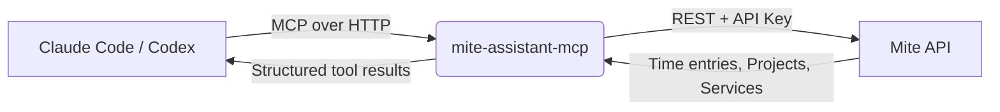

A personal weekend project born out of a real daily friction: having to context-switch between coding and filling in time entries in Mite. The idea was simple - let the AI assistant handle it while I stay in my editor. I built an MCP (Model Context Protocol) server that exposes Mite's REST API as a set of structured tools, so Claude Code or Codex can query, create, and update time entries through natural language.

### Key Features & Details

- **Protocol**: Implements the **Model Context Protocol** (MCP) - the open standard for AI tool integration by Anthropic
- **Auth**: Stateless bearer token auth - the client passes the Mite API key with every request, no session storage needed
- **Smart name resolution**: Say "log 90 minutes to project Development" and the server resolves the name to a Mite project ID automatically
- **Flexible time queries**: Predefined frames (`today`, `this_week`, `last_month`, …) or exact date ranges in `YYYY-MM-DD`
- **Full CRUD**: `list_time_entries`, `create_time_entry`, `update_time_entry`, `delete_time_entry` + `whoami`
- **Zero persistence**: No database, no state - pure HTTP passthrough to the Mite API
- **Health check**: `/health` endpoint for uptime monitoring

> **Why MCP?** It gives AI assistants a typed, discoverable interface rather than raw HTTP calls - meaning the model understands what each tool does and can chain calls intelligently (e.g. look up a project ID before creating an entry).
