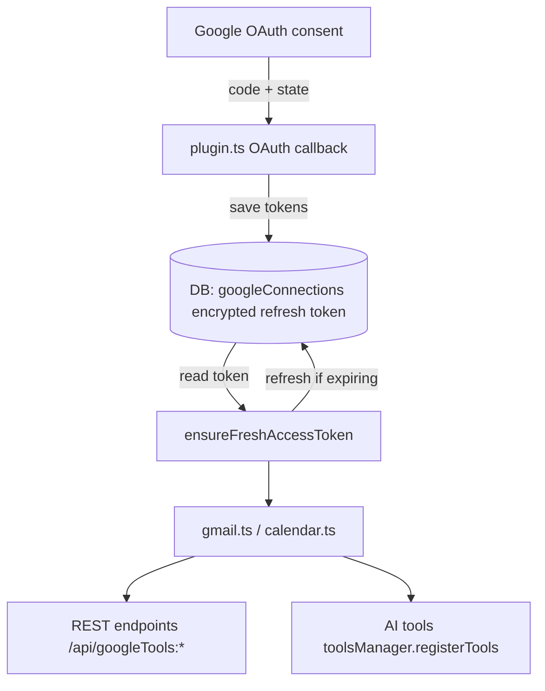

A NocoBase plugin that connects NocoBase's built-in **AI employees** to a user's **Gmail** and **Google Calendar** via user-consented OAuth. Built to explore NocoBase's plugin system, AI tool registration API, and what it actually takes to wire a real OAuth flow into a low-code platform.

### What it does

- **OAuth popup flow** — a "Connect Google" block you drop on any page; one click opens a Google consent screen in a popup, which auto-closes on success and flips the block to show the connected account
- **Automatic token rotation** — access tokens are refreshed transparently before every Gmail/Calendar call using the stored refresh token, so AI agents can keep acting without re-prompting for consent
- **AI tool registration** — if the NocoBase AI plugin is enabled, 9 tools are registered with `aiManager.toolsManager` so any AI employee can list/read/send emails and list/create/update/delete calendar events on behalf of the user it's chatting with
- **REST endpoints** — the same operations are exposed as plain HTTP endpoints, callable by any external agent or HTTP client
- **Per-user isolation** — every token lookup is keyed by `userId`, so employee A only ever touches user A's Google account
- **Privacy-safe cleanup** — tokens are revoked and dropped from the DB when the plugin is disabled or uninstalled

### Key technical pieces

- Credentials live in NocoBase **Variables and Secrets** (falls back to env vars)
- Shipped as a `.tgz` you drop into `./storage/plugins/` — no source build required to install
- CI builds and uploads a release tarball on every tag via GitHub Actions

> Purely exploratory — a sandbox for learning NocoBase's extension model and seeing how far its AI employee system can reach into real external APIs.